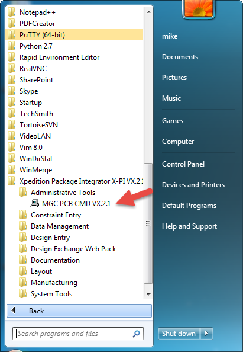
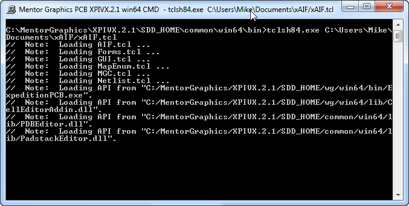
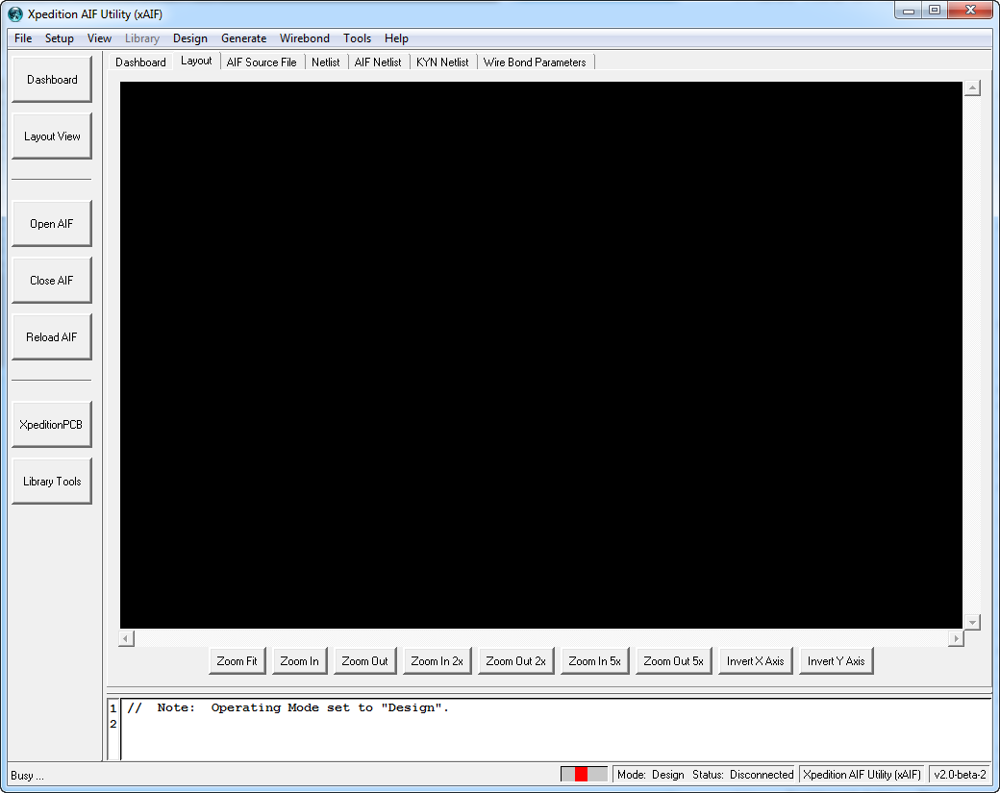

Xpedition xAIF
=========

Xpedition xAIF is a utility, written in [Tcl/Tk](http://www.tcl.tk/about/ "Tcl/Tk"), to import AIF files into Mentor Graphics Xpedition xPCB layout tool.

Xpedition xAIF works in conjunction with Library Manager and Xpedition xPCB to process the information contained in an AIF file and generate the necessary library and design elements necessary to implement an IC Package design.

The [AIF Format](http://artwork.com/package/aif/index.htm "Die and Package Database Format") is a pseudo industry standard ASCII file format created by [Artwork Conversion Services](http://www.artwork.com "Artwork Conversion Services") which is used for sharing package design and implementation tools.

The AIF specification is documented on the ACS web site:
What's in an AIF File?
Multi Die AIF

Examples
-
Unfortunately there are not many example AIF files to use as a reference.  In fact, there is [only one on the ACS web site](http://artwork.com/package/aif/sample_aif_files.htm "Sample AIF File")!  Here are a few  which have been used for development and testing:
- [Demo1.aif](https://github.com/mpwalsh8/xAIF/blob/master/data/Demo1.aif "Demo AIF #1")
- [Demo2.aif](https://github.com/mpwalsh8/xAIF/blob/master/data/Demo2.aif "Demo AIF #2")
- [Demo3.aif](https://github.com/mpwalsh8/xAIF/blob/master/data/Demo3.aif "Demo AIF #3")

Requirements
-
Mentor Graphics only supports Tcl 8.4.x with Xpedition family of applications.  As part of the Xpedition or XPI flow installation, Mentor Graphics includes a bundled version Tcl/Tk 8.4 compiled for the proper application version and platform.  Mentor's version of Tcl/Tk includes tcom, the COM interface for Tcl which allows Tcl to be used with the Xpedition API.  Xpedition xAIF is developed using Mentor's bundled version of Tcl.  The bundled version of Tcl does not include many libraries, so xAIF includes several Tcl based libraries required for the application to run ([BWidget](https://core.tcl.tk/bwidget/home "BWidget"), [Tcllib](https://www.tcl.tk/software/tcllib/ "Tcllib"), [Tklib](https://www.tcl.tk/software/tklib/ "Tklib")).

Installation and Operation
-
Xpedition xAIF is currently a work-in-progress.  Download (or clone) Xpedition xAIF from GitHub.  Invoking the xAIF application differs from Windows and Linux.

### Windows ###
Open a MGC PCB CMD window from the Start Menu.  The MGC PCB CMD utility is a standard Windows CMD window with the Mentor environment preconfigured.  Environment variables are set correctly so applications which use the API work without additional setup or configuration.

Selecting MGC PCB CMD VX.2.1 (or the desired version) from the Start menu will open the window.  To launch xAIF, type **tclsh84.exe <path_to>\xAIF\xAIF.tcl** as shown in the image below.

As xAIF starts running it will trascript some messages as it loads the various APIs and initializes.  When finished, the xAIF GUI is presented to the user. 

The full AIF specification has not been implemented.  Unsupported keywords in the AIF file are noted in red text when viewing the source within the xAIF GUI on the ***AIF Source File*** tab.

Usage
-
In order to generate a usable Xpedition design from an AIF source file, do the following:

1. Setup a file folder structure to store the library and design data which will be generated from the AIF file.  The design data can be generated into an existing Central Library however it is recommended that a new, and empty, Central Library be used as a sandbox.
	1. Create a top level folder:  ExampleAIF
	2. Create a folder for design data:  ExampleAIF\Design
	3. Create a folder for the Central Library:  ExampleAIF\Library
4. Open Library Manager and create (File > New) a Central Library in the ExampleAIF\Library folder.
5. Open XpeditionPCB and navigate to the 4 Layer template which will be created in the Central Library  which was just created.  This template is for a 4 layer key-in netlist PCB design, some of the settings will be changed to support the package design being imported via AIF.
	1. Within XpeditionPCB, use File > Save As to save the design into the ExampleAIF\Design folder created previously.  The user will be prompted with several questions.  
	3. There is no need to worry about Central Library association yet, it will be handled later via Project Integration.
	4. Use "Design" for the project name when prompted.
	5. After the Save, close the database within XpeditionPCB (File > Close)
	6. From Windows Explorer, navigate to ExampleAIF\Design where the PCB database will still be called "template.pcb".  Rename this file to "Design.pcb" so it matches the "Design.prj" file.
	7. No further changes are required at this point.
8. Invoke Xpedition xAIF which will bring up the UI.
	1. Load the AIF source file (File > Open or use the Select AIF button on the Dashboard tab).  The process of loading  the AIF file can take several minutes depending on the size and complexity of the design.
	2. Once loaded, examine the various tabs to visualize the design (Layout tab) and AIF processing (AIF Netlist tab).
	3. Set xAIF in Central Library mode (from the Dashboard or Setup pulldown menu).  If Library Manager is running, xAIF will attempt to connect to it to retrieve the Central Library it will use to target the library elements which will be generated.  If Library Manager is not running, use the Library button to navigate to the LMC created earlier.
		1. If the LMC has existing Cell and Part partitions they can be specified by choosing the appropriate button.
		2. xAIF will create partitions if none exist to store generated cells and PDBs.
	3. 